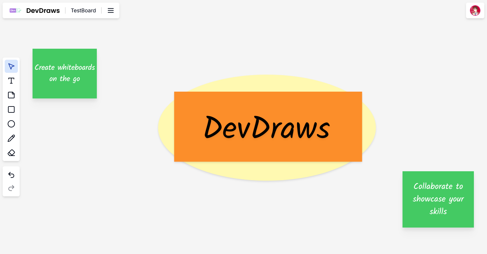

# 📌 DevDraws  

**DevDraws** is a real-time, collaborative whiteboard application that enables users to create, edit, and share visual content seamlessly. Whether you need to brainstorm, sketch ideas, or collaborate remotely, DevDraws provides an intuitive and interactive experience.  

  

## ✨ Features  

- 🎨 **Real-time collaboration** – Multiple users can draw, add shapes, and edit the board simultaneously.  
- 📝 **Text and Sticky Notes** – Add formatted text and sticky notes to highlight important ideas.  
- 📐 **Shapes & Drawing Tools** – Create rectangles, circles, lines, and freehand drawings.  
- 📷 **Intuitive UI** – Simple and clean design for effortless usage.  
- 🛠 **Undo/Redo Support** – Easily revert or reapply changes.  


## 🚀 Getting Started  

### **1. Clone the Repository**  

```

git clone https://github.com/your-username/devdraws.git

cd devdraws

```

### **2. Install required dependencies**

```

npm install
or
pnpm install (use for this project)
or
yarn install
or
bun install (reccomended)

```

### **3. Run the development server**

```

npm run dev
or
pnpm run dev (use for this project)
or
yarn run dev
or
bun run dev (reccomended)

```

Open [http://localhost:3000](http://localhost:3000) with your browser to see the result.

This project uses [`next/font`](https://nextjs.org/docs/basic-features/font-optimization) to automatically optimize and load Inter, a custom Google Font.

## 🏗 Tech Stack

- Next.js – Fast, server-rendered React framework.
- TypeScript – Strongly typed JavaScript for better development.
- Liveblocks – Enables real-time collaboration.
- Tailwind CSS – Modern utility-based styling.

## 🛠 Contributing

We welcome contributions! Follow these steps:
- Fork the repo and create a new branch.
- Make your changes and commit with a clear message.
- Submit a Pull Request (PR) for review.

## 🤝 Connect

For support or suggestions, feel free to open an issue or [contact us!](mailto:kumararnim1@vivaldi.net)

## Learn More

To learn more about Next.js, the tech stack used to build this project you can take a look at the following resources:

- [Next.js Documentation](https://nextjs.org/docs) - learn about Next.js features and API.
- [Learn Next.js](https://nextjs.org/learn) - an interactive Next.js tutorial.


